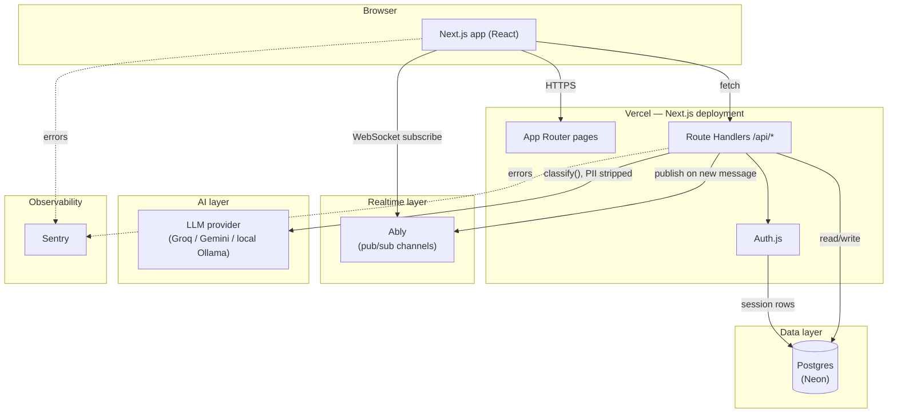
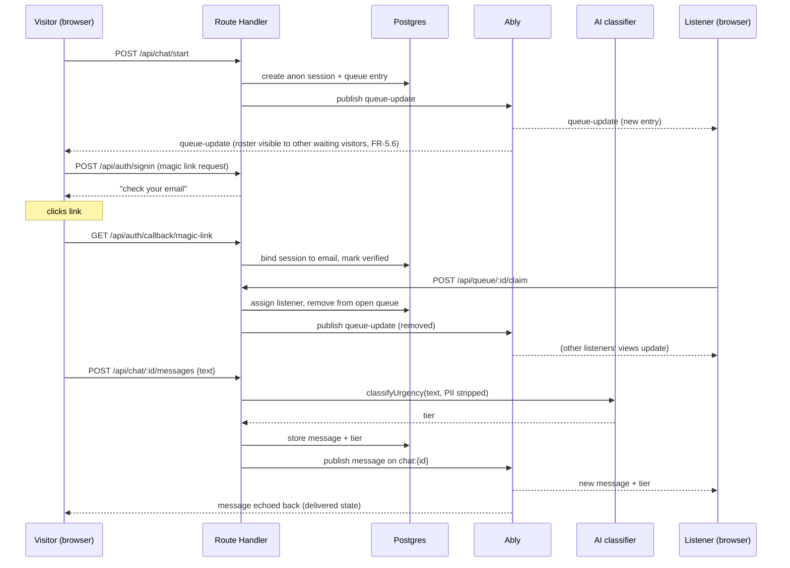
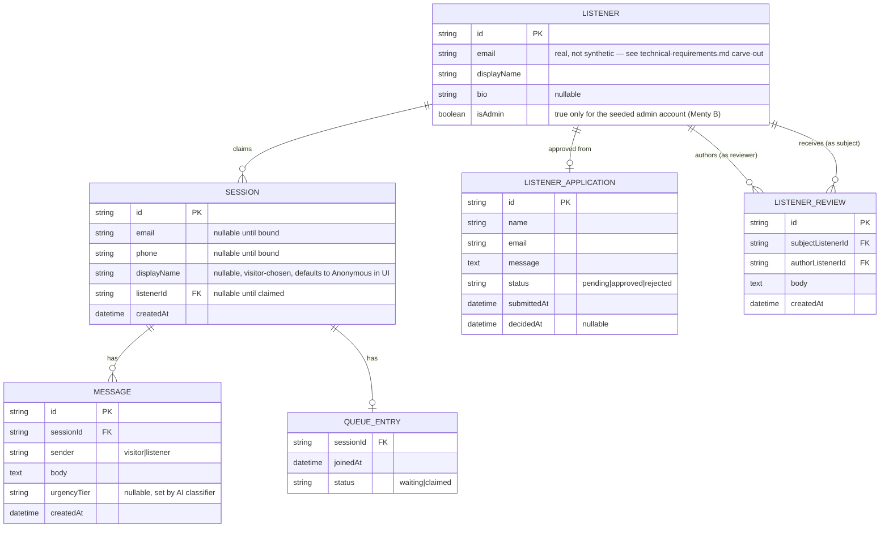
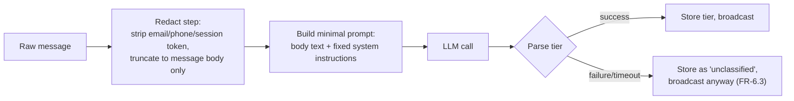

# Architecture — overshare.io

## Components

Everything client-facing is one Next.js deployment. There is no separate
backend service in the MVP — Route Handlers *are* the backend. The only
reason a second always-on process would enter the picture is if we outgrow
Ably's free tier and self-host the realtime layer (see
`docs/hosting-and-scaling.md`).

## Why realtime is a separate box from the API

Vercel's Route Handlers are serverless: each request spins up, runs, and
exits. They cannot hold a WebSocket connection open waiting for the next
message. So the API's job is narrower than it looks — it writes to Postgres
and then **publishes** an event; it never holds a connection. Ably holds the
actual open connections to every browser tab and fans out the event. This is
the single most important shape decision in the whole system, and it's the
same constraint krisenchat's own Vercel deployment would face — see
`research/krisenchat-recon.md` for why we believe they solve it the same way.

## Sequence — a full chat session

## Data model (overview)

Note what's deliberately **not** modeled on `SESSION`: no `dateOfBirth` or
`address` field anywhere, and `displayName` is an optional, visitor-chosen
pseudonym shown to other queue members (FR-5.5) — not an identity field, and
never required (FR-1.3). The schema itself is part of the privacy design, not
just the code that reads from it.

`LISTENER`/`LISTENER_APPLICATION` are the one deliberate exception: real
name, real email, by design (FR-8, FR-9) — see the carve-out in
`docs/technical-requirements.md`. Keep this data on its own tables, never
joined into `SESSION`/`MESSAGE` in a way that would blur visitor anonymity
with Listener identity.

## Request flow for the AI feature specifically

The redact step runs **before** anything leaves our server, so the prompt the
model sees is the smallest possible slice of the conversation. See
`docs/challenges/ai-triage.md` for the exact fields stripped and the
reasoning behind each.

## Deployment topology

- One Vercel project, two environments: `preview` (every branch) and
  `production` (main). Free tier covers both.
- Postgres: one free Neon project, EU region (Frankfurt) — see hosting doc
  for why region is a deliberate choice here, not a default left alone.
- Ably: one free app, EU cluster if available on the free tier at signup
  time (verify — this can change).
- Secrets (DB URL, Ably key, model API key, Brevo key) live in Vercel's
  environment variable store, never in the repo.
