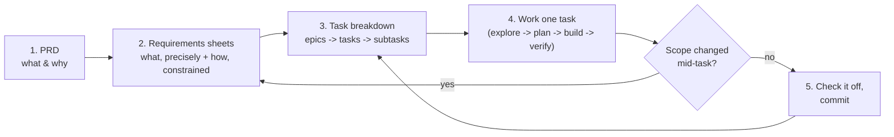

# The workflow — spec → tasks → build loop

This is the thing you were trying to remember. It's a standard pattern for
working with an agent on non-trivial software, and it's why this repo has the
files it has.

## The shape of it

It's a loop, not a waterfall — step 4 regularly kicks you back to step 2 when
you learn something the spec got wrong. The discipline is *where* that
correction goes: back into the requirements doc, not silently absorbed into
code that now disagrees with its own spec.

## Each stage, concretely, in this repo

### 1. PRD — `docs/PRD.md`

The vision layer. Answers "what are we building, for whom, and what are we
explicitly not building." Changes rarely. If you're debating whether a
feature belongs in this project at all, the answer lives here.

### 2. Requirements sheets — `docs/product-requirements.md` + `docs/technical-requirements.md`

The precision layer. Turns the PRD's intent into numbered, testable
requirements (FR-1.1, FR-1.2, ...) and fixes the technical constraints
(stack, performance targets, privacy rules) those requirements have to live
inside. This is what a task gets *checked against* when you ask "is this
done."

### 3. Task breakdown — `tasks/TASKS.md`

The sequencing layer — this is "the sheet" you were remembering. Each
requirement gets broken into tasks small enough to finish in one sitting
(this repo's convention: under ~2 hours), and each task can be broken further
into subtasks/checkboxes if it's still too big to hold in your head at once.
A task should reference which requirement ID(s) it satisfies, so you can
trace backward from "why are we building this" at any point.

The reason to scope this small isn't bureaucracy — it's that a task you can't
finish in one sitting is a task where you'll lose track of what "done" meant
by the time you get back to it. Small tasks are cheap to re-plan; big ones
aren't.

### 4. Work a task

For each task, the useful sub-loop is:

1. **Explore** — read the relevant existing code/doc before writing anything.
   Don't start typing into an unfamiliar area cold.
2. **Plan** — for anything non-trivial, state the approach in a sentence or
   two before implementing, especially if there's more than one reasonable
   way to do it.
3. **Build** — implement just this task's scope. Resist pulling in the next
   task's work "while you're in there."
4. **Verify** — run it, test it, look at it. A task isn't done because the
   code compiles; it's done because the acceptance criteria in
   `docs/product-requirements.md` are met.

   Concretely, per `docs/technical-requirements.md`'s Testing expectations:
   run `npm test` continuously while touching `lib/` or a component — it's
   fast and needs nothing running. Run `npm run test:all` (unit + component
   + integration + E2E, needs local Postgres up — see that doc's Local
   development setup section) once before checking a task off, and always
   before opening a PR — CI (`.github/workflows/ci.yml`) runs the same suite
   on push as the final backstop, so local `test:all` is what catches a
   failure before it's someone else's problem.

### 5. Check it off and move on

Update `tasks/TASKS.md` immediately, not in a batch at the end of a session —
the task list is only useful as a source of truth if it's actually current.
If the task revealed that a requirement was wrong or incomplete, fix the
requirement doc *first*, then adjust any sibling tasks it affects, then
continue.

## Why this beats "just start coding"

Skipping straight to code on a multi-feature project means every decision
(scope, stack, privacy handling, hosting) gets made implicitly, in the
moment, under the pressure of whatever you're looking at right that second.
Writing it down first doesn't slow you down — it moves those decisions to a
point where you can see the whole picture, and it gives you something
concrete to hand to someone else (an interviewer, a reviewer, future-you) that
explains *why* the code looks the way it does.
